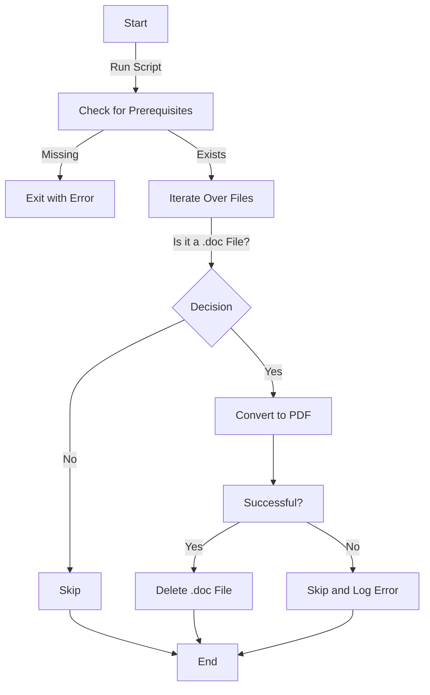

## Doc to PDF Converter 📄➡️📜
> A robust bash script for converting `.doc` files to `.pdf` using LibreOffice, Pandoc, or Unoconv.

### Table of Contents 📚
- [Overview](#overview)
- [Prerequisites](#prerequisites)
- [Installation](#installation)
- [Usage](#usage)
- [Workflow](#workflow)
- [Methods](#methods)
  - [LibreOffice](#libreoffice)
  - [Pandoc](#pandoc)
  - [Unoconv](#unoconv)
- [Contributing](#contributing)
- [License](#license)

### Overview 🎯
This bash script provides a versatile solution for converting `.doc` files in a specified directory to `.pdf` format. It can use multiple backends for the conversion, including LibreOffice, Pandoc, or Unoconv.

### Prerequisites 🛠️

- LibreOffice, Pandoc, or Unoconv must be installed.
- Bash shell is required.

### Installation 🛠️

1. Clone this repository:
    ```bash
    git clone https://github.com/yourusername/doc-to-pdf-converter.git
    ```
2. Navigate to the project directory:
    ```bash
    cd doc-to-pdf-converter
    ```
3. Make the script executable:
    ```bash
    chmod +x doc_to_pdf.sh
    ```

### Usage 🚀
To use the script, simply run the `doc_to_pdf.sh` script in the directory containing `.doc` files you wish to convert:

```bash
./doc_to_pdf.sh
```

### Workflow 📋



### Methods 🛠️

#### LibreOffice
```bash
libreoffice --headless --convert-to pdf:writer_pdf_Export /path/to/file.doc
```

#### Pandoc
```bash
pandoc /path/to/file.doc -o /path/to/file.pdf
```

#### Unoconv
```bash
unoconv -f pdf /path/to/file.doc
```

### Contributing 🤝
Feel free to fork this repository, make changes, and submit pull requests. Any kind of contributions are welcome!

### License 📝
This project is licensed under the MIT License. See `LICENSE` for more details.

---
