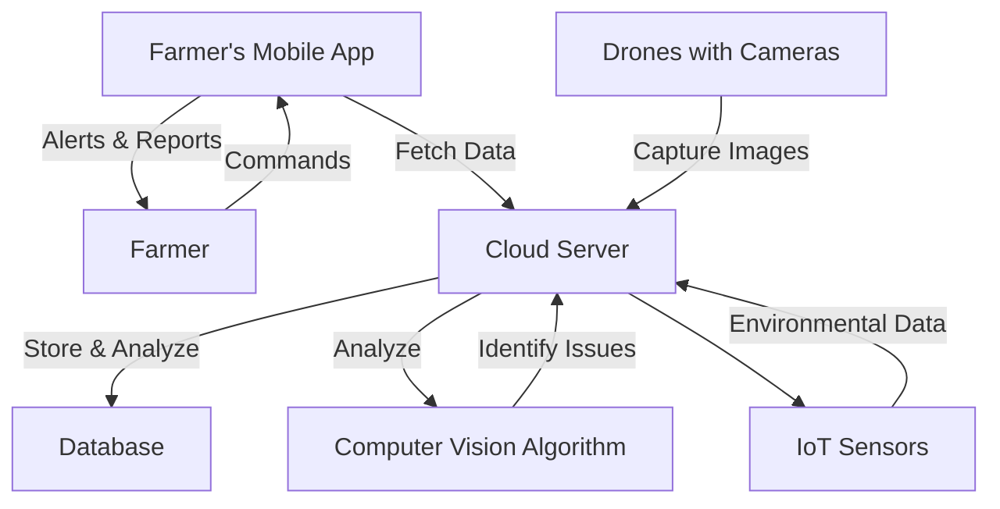

Certainly, a "mermaid view" usually refers to a simplified diagram to represent the architecture or flow of a system. Below is a text-based representation for the Smart Farming Vision System:

This diagram outlines the primary components and interactions within the Smart Farming Vision System:

- **Farmer's Mobile App**: The interface where the farmer receives alerts and sends commands.
  
- **Farmer**: The end-user who interacts with the system.

- **Cloud Server**: Central hub where data is collected and processed.

- **Database**: Storage for historical data and images.

- **Drones with Cameras**: Aerial devices that capture real-time images of the farm.

- **Computer Vision Algorithm**: Analyzes the images to identify issues like pests or unhealthy crops.

- **IoT Sensors**: Collect environmental data like humidity, temperature, etc., which can be correlated with image data for more accurate results.

This simplified view provides an idea of how different elements of the Smart Farming Vision System interact with each other.
