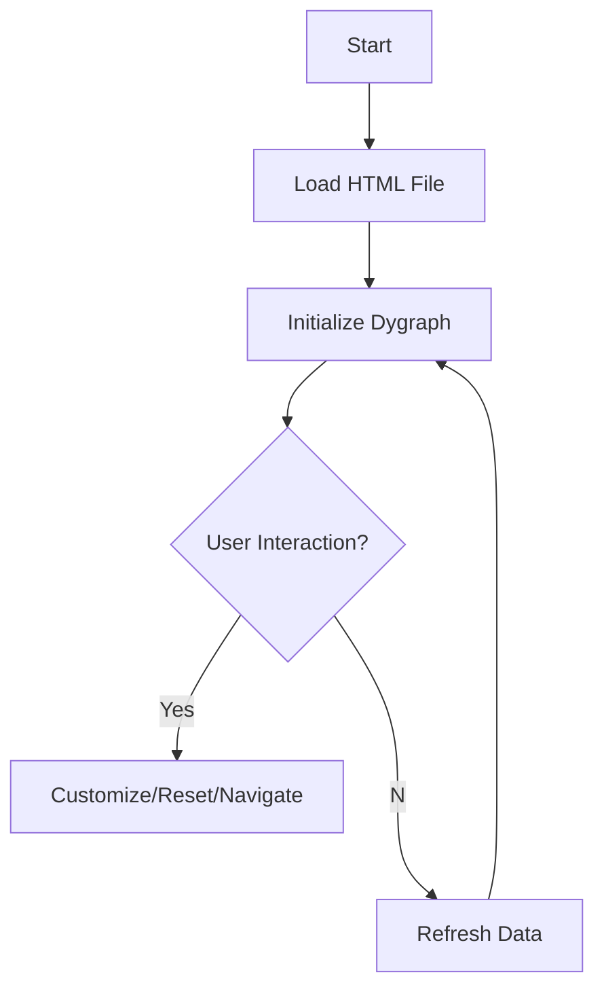

## 🌡️ Raspberry Pi Temperature Graphs with Dygraph

This project showcases how to display Raspberry Pi CPU temperature graphs using Dygraph, an open-source JavaScript library.

### 📚 Table of Contents

- [Description](#description)
- [Installation](#installation)
- [Usage](#usage)
- [Options](#options)
- [Examples](#examples)
- [Diagram](#diagram)
- [Contributions](#contributions)

### 📜 Description

This project features an HTML file that displays temperature data graphs from a Raspberry Pi CPU. Data is sourced from a `web-temp.txt` file and visualized using the Dygraph JavaScript library.

### ⚙️ Installation

1. Clone the repository
   ```bash
   git clone https://github.com/DmPanf/Bash_admin_scripts.git
   ```
2. Navigate to the directory
   ```bash
   cd dygraph-raspberry-temp
   ```
3. Open the HTML file in a browser.

### 🚀 Usage

To visualize your temperature data:

1. Update `web-temp.txt` with your Raspberry Pi CPU temperature data.
2. Open the HTML file in a web browser.

### ⚙️ Options

- **Back Button**: Navigates back in the browser history.
- **Reset Button**: Resets the graph.
- **MyGraf**: Customizes the graph's appearance.
- **Info**: Displays the data file used.
- **Street**: A button for navigating to `ztemp.html`.

### 📝 Examples

After opening the HTML file in a web browser, you'll see:

- Graphs displaying temperature.
- Buttons for navigation and customization.

### 📊 Diagram



### 👥 Contributions

Feel free to contribute by opening a Pull Request or reporting any issues.🌡️📊
