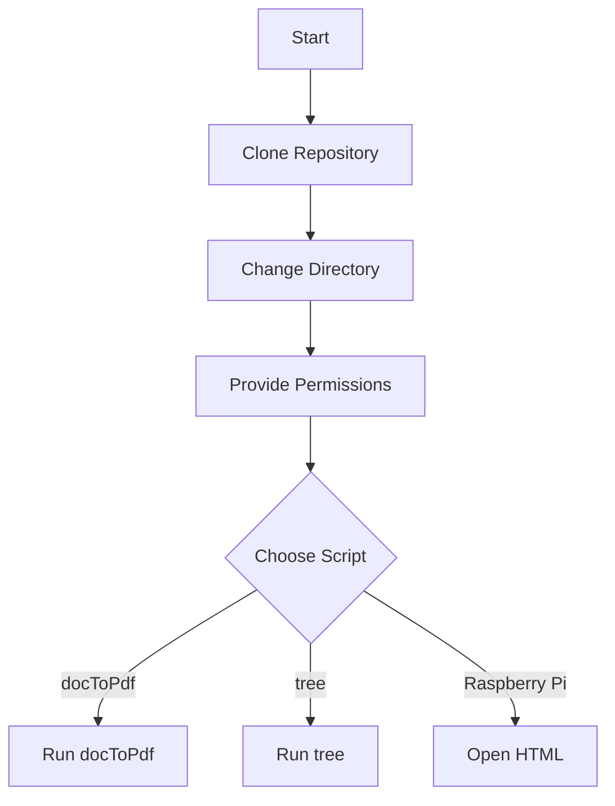

## 🛠️ Bash Admin Tools for Linux Administration

A collection of powerful Bash scripts for system administration tasks, making your life easier and your work more efficient!

### 📚 Table of Contents

- [Introduction](#introduction)
- [Installation](#installation)
- [Scripts Overview](#scripts-overview)
  - [docToPdf Converter](#doctopdf-converter)
  - [Directory Tree Viewer](#directory-tree-viewer)
  - [Raspberry Pi Temperature Graphs](#raspberry-pi-temperature-graphs)
- [Usage](#usage)
- [Contributing](#contributing)
- [Diagram](#diagram)
- [License](#license)

### 📜 Introduction

This repository hosts a collection of Bash scripts aimed at simplifying common tasks for system administrators. From document conversion to system monitoring, these scripts are your one-stop solution.

### 🛠️ Installation

1. Clone the repository:
   ```bash
   git clone https://github.com/DmPanf/Bash_admin_scripts.git
   ```
2. Navigate to the cloned directory:
   ```bash
   cd Bash_Admin_Scripts
   ```
3. Provide execution permissions to the scripts:
   ```bash
   chmod +x *.sh
   ```

### 📋 Scripts Overview

#### 📄 docToPdf Converter

A simple Bash script that converts `.doc` files to `.pdf`.

Usage:

```bash
./docToPdf.sh
```

#### 🌲 Directory Tree Viewer

This script allows you to view directory trees.

Usage:

```bash
./tree.sh
```

#### 🌡️ Raspberry Pi Temperature Graphs

Visualize your Raspberry Pi CPU temperature with the help of Dygraph.

Usage:

Open the provided HTML file in a web browser.

### 🚀 Usage

Each script comes with its own usage guidelines. Please refer to individual script READMEs for more details.

### 🤝 Contributing

Feel free to contribute! Open an issue or submit a Pull Request.

### 📊 Diagram



### 📄 License

This project is licensed under the MIT License. See `LICENSE` for more information. 🛠️📚
