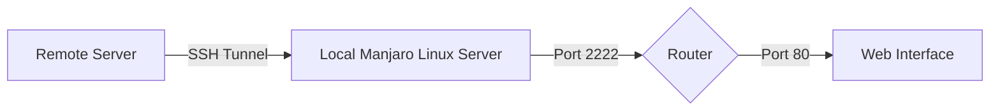

# SSH Port Forwarding Guide 🚀

## Overview 🌐

This guide provides detailed instructions on how to set up SSH port forwarding to access the internal port 80 of a local router from a remote Linux server. This is particularly useful for accessing local network resources from an external network.

## Requirements 📋

- A local network with a Linux server running Manjaro.
- A local router with an internal IP address of 192.168.1.1.
- An external IP address (example given: 85.3.87.4) with a dedicated port (2222 in this case).
- SSH access to the remote Linux server.

## Architecture Diagram (Mermaid) 📊



In this setup, we establish an SSH tunnel from the remote server to the local Manjaro Linux server. The traffic is then forwarded from port 2222 on the local server to port 80 of the router.

## Step-by-Step Guide 🛠️

### Step 1: Setting Up SSH Tunnel

On your remote server, execute the following command to set up the SSH tunnel:

```bash
ssh -L 2222:192.168.1.1:80 your_username@85.3.87.4
```

Replace `your_username` with your username on the Manjaro Linux server with the external IP `85.3.87.4`.

### Step 2: Configuring Router and Firewall

- Ensure that port `2222` is open for incoming connections on your Manjaro Linux server.
- Set up NAT or routing rules on your router if required to allow the redirection from port `2222` to port `80`.

### Step 3: Testing the Connection

After setting up the tunnel, test the connection by accessing port `2222` on your remote server. If the setup is correct, you should be able to reach the router's web interface.

## Security Considerations 🔒

- Ensure that your SSH keys are secure and up-to-date.
- Regularly check for any unauthorized access or unusual activities.
- Keep your server and router firmware up-to-date with the latest security patches.

## Conclusion 🎉

With these steps, you should now be able to securely access internal network resources from a remote location using SSH port forwarding. This method provides a convenient way to manage local network devices remotely 🌟
