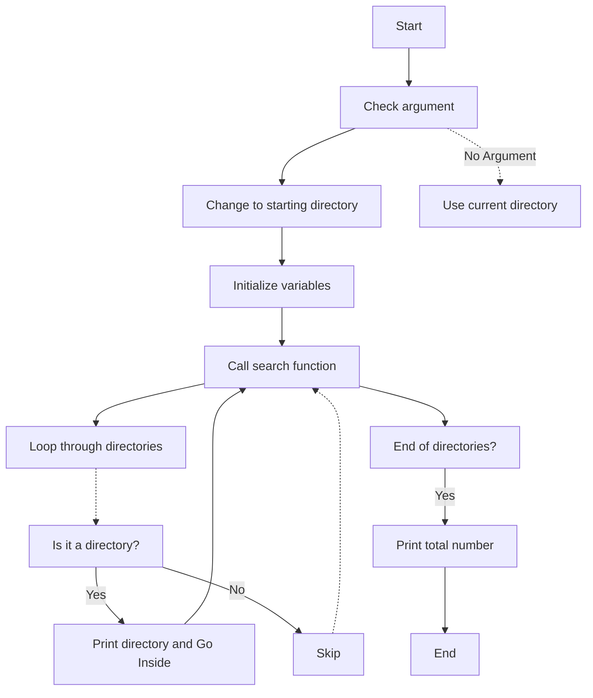

## 🌳 Tree Directory Listing Script (`tree.sh`)

A simple Bash script to recursively list and visualize the directory structure.

### 📚 Table of Contents

- [Description](#description)
- [Installation](#installation)
- [Usage](#usage)
- [Examples](#examples)
- [Diagram](#diagram)
- [Contributions](#contributions)

### 📜 Description

The `tree.sh` script is designed to recursively list and display directories in a tree-like format. This script handles symbolic links and prints out the directory structure in an easy-to-read visual layout.

### ⚙️ Installation

To use this script, simply clone this repository and make sure you have permission to execute the script.

```bash
git clone https://github.com/DmPanf/Bash_admin_scripts/blob/main/Tree/tree.sh.git
chmod +x tree.sh
```

### 🚀 Usage

You can run the script with or without an argument:

- Without an argument, the script lists the directories in the current directory.
  
  ```bash
  ./tree.sh
  ```
  
- With an argument, it lists the directories in the specified directory.
  
  ```bash
  ./tree.sh /path/to/directory
  ```

### 📝 Examples

1. To list the current directory structure:

    ```bash
    ./tree.sh
    ```

    Output:

    ```
    Starting directory = /home/user/Documents
    +---Folder1
    +---Folder2
    ```

2. To list a specific directory structure:

    ```bash
    ./tree.sh /home/user/Downloads
    ```

    Output:

    ```
    Starting directory = /home/user/Downloads
    +---File1
    +---File2
    ```

### 📊 Diagram

Here's a Mermaid diagram to explain the flow of the script.



### 👥 Contributions

Feel free to contribute by opening a Pull Request or reporting any issues.

---
