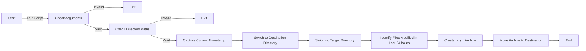

## Bash Backup Script 🗃️
> A simple yet effective script for backing up files modified within the last 24 hours from a target directory to a destination directory.

### Table of Contents 📚
- [Overview](#overview)
- [Installation](#installation)
- [Usage](#usage)
- [Workflow](#workflow)
- [Contributing](#contributing)
- [License](#license)

### Overview 🎯
This bash script provides a simple solution for taking backups of files that have been modified within the last 24 hours in a specified directory. It bundles these files into a `.tar.gz` compressed archive and moves it to a destination directory.

### Installation 🛠️

1. Clone this repository:
    ```bash
    git clone https://github.com/yourusername/backup-script.git
    ```
2. Navigate to the project directory:
    ```bash
    cd backup-script
    ```
3. Make the script executable:
    ```bash
    chmod +x backup.sh
    ```

### Usage 🚀
To use the script, simply run the `backup.sh` script followed by the target and destination directories as arguments:

```bash
./backup.sh /path/to/target/directory /path/to/destination/directory
```

For example:

```bash
./backup.sh ~/Documents ~/Backups
```

### Workflow 📋



### Contributing 🤝
Feel free to fork this repository, make changes, and submit pull requests. Any kind of contributions are welcome!

### License 📝
This project is licensed under the MIT License. See `LICENSE` for more details.

---

